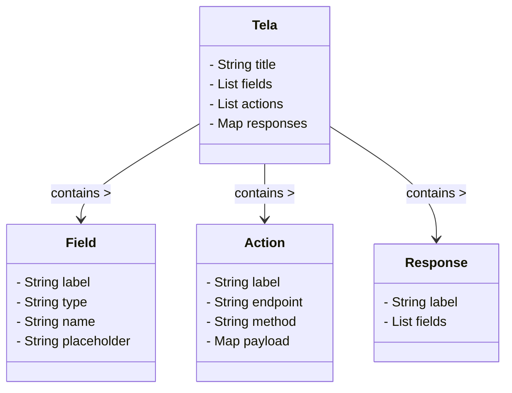

# BeautyApi 

## Diagrama de Classes

```mermaid

classDiagram
    class Tela {
        - String title
        - List<Field> fields
        - List<Action> actions
        - Map<String, Response> responses
    }
    
    class Field {
        - String label
        - String type
        - String name
        - String placeholder
    }
    
    class Action {
        - String label
        - String endpoint
        - String method
        - Map<String, String> payload
    }
    
    class Response {
        - String label
        - List<Field> fields
    }
    
    Tela --> Field : contains >
    Tela --> Action : contains >
    Tela --> Response : contains >
```
